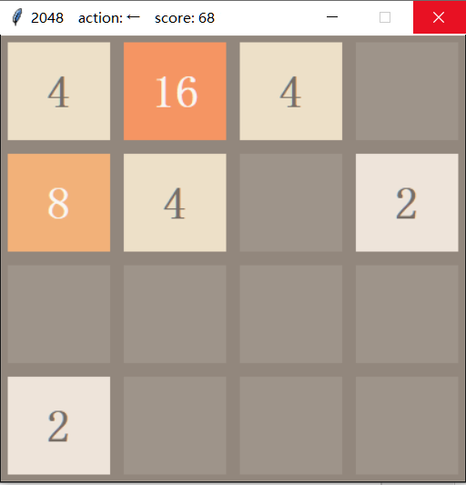

# paly_2048_gym_by_RL
使用强化学习训练智能体玩基于gym环境的2048游戏

## 安装依赖
paddlepaddle(CPU) >= 1.6.3  
parl == 1.3.1  
gym  
gym_game2048  

## gym_game2048 安装方式
使用cmd cd到gym-game2048目录下  
运行 pip install -e .  

## gym_game2048环境说明
gym_game2048兼容gym接口。使用下面的代码创建环境：  
    
    env = gym.make("game2048-v0", board_size=board_size, seed=seed, binary=binary, extractor="cnn", penalty=-10)  
board_size:2048的方格数。  
seed:随机种子。  
binary:采用二进制输出还是十进制输出，True代表二进制，False代表十进制。二进制输出为4*4*16的numpy数组，取值只有0和1，十进制输出为16*1的一维向量，取值即为正常2048看到的数字。  
extractor:取值为"cnn"或"mlp"。注意，当取值为"mlp"是，binary只能为False。

## 相关说明
该2048游戏基于gym环境，2048源代码来源于https://github.com/FelipeMarcelino/2048-Gym  
不同的地方在于：我自己另写了一个环境渲染函数,增加了动作指示和分数显示，并将环境渲染函数集成到了安装环境里。  
原来的环境渲染没有集成到安装环境，需要使用另外的函数显示，详见https://github.com/FelipeMarcelino/2048-Gym/blob/master/model/show_played_game.py。

## 我的环境渲染截图

## 运行视频

## 参考资料见reference目录

## 训练结果
目前我的训练结果不是很理想，最大只能堆积到256，分数最高2000分左右。  
希望大家可以获得理想的效果。

